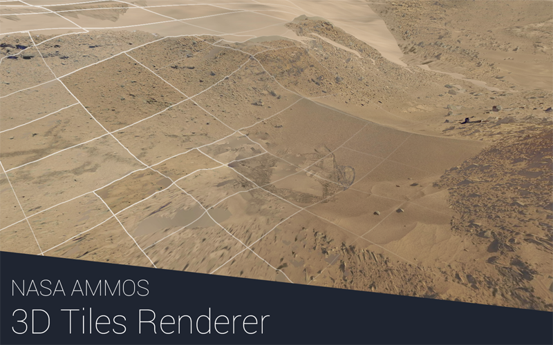

# 3d-tiles-renderer

[](https://www.npmjs.com/package/3d-tiles-renderer)
[](https://github.com/NASA-AMMOS/3DTilesRendererJS/actions)



Three.js renderer implementation for the [3D Tiles format](https://github.com/AnalyticalGraphicsInc/3d-tiles/blob/master/specification/). The renderer supports most of the 3D Tiles spec features with a few exceptions. For a list of available data sets and generation tools see the [3d Tiles resources](https://github.com/CesiumGS/3d-tiles/blob/main/RESOURCES.md) list.

If a tile set or geometry does not load or render properly please make an issue! Example data is needed for adding and testing features. See the [Feature Complete Milestone](https://github.com/NASA-AMMOS/3DTilesRendererJS/milestone/1) for information on which features are not yet implemented.

**Examples**

[Dingo Gap Mars dataset with multiple tile sets](https://nasa-ammos.github.io/3DTilesRendererJS/example/bundle/mars.html)

[Kitchen sink example with all options here](https://nasa-ammos.github.io/3DTilesRendererJS/example/bundle/index.html)

[Rendering in VR example here](https://nasa-ammos.github.io/3DTilesRendererJS/example/bundle/vr.html)

**External Tiles Providers**

_Personal [Google Tiles API Key](https://developers.google.com/maps/documentation/tile/3d-tiles) or [Cesium Ion API Key](https://cesium.com/platform/cesium-ion/) required_

[Cesium Ion 3D Tiles](https://nasa-ammos.github.io/3DTilesRendererJS/example/bundle/ionExample.html)

[Cesium Ion Lunar Tiles](https://nasa-ammos.github.io/3DTilesRendererJS/example/bundle/ionLunar.html)

[Google Photorealistic Tiles](https://nasa-ammos.github.io/3DTilesRendererJS/example/bundle/googleMapsAerial.html)

[Google Globe Tiles](https://nasa-ammos.github.io/3DTilesRendererJS/example/bundle/googleMapsExample.html)

**Customization**

[Custom material example](https://nasa-ammos.github.io/3DTilesRendererJS/example/bundle/customMaterial.html)

[Rendering shadows from offscreen tiles example](https://nasa-ammos.github.io/3DTilesRendererJS/example/bundle/offscreenShadows.html)

[Alterate texture overlays](https://nasa-ammos.github.io/3DTilesRendererJS/example/bundle/landformSiteOverlay.html)

**Plugins**

[Tile Metadata](https://nasa-ammos.github.io/3DTilesRendererJS/example/bundle/metadata.html)

[Tile LoD Fade Transition](https://nasa-ammos.github.io/3DTilesRendererJS/example/bundle/fadingTiles.html)

**Debug Pages**

[B3DM Loading](https://nasa-ammos.github.io/3DTilesRendererJS/example/bundle/b3dmExample.html)

[I3DM Loading](https://nasa-ammos.github.io/3DTilesRendererJS/example/bundle/i3dmExample.html)

[PNTS Loading](https://nasa-ammos.github.io/3DTilesRendererJS/example/bundle/pntsExample.html)

[Ellipsoid Region Bounds](https://nasa-ammos.github.io/3DTilesRendererJS/example/bundle/ellipsoid.html)

**React Three Fiber**

See the [dedicated documentation](./src/r3f/README.md) for information on using the project with `@react-three/fiber`.

# Use

## Installation

```
npm install 3d-tiles-renderer --save
```

## Basic TilesRenderer

Setting up a basic application with a 3D Tile Set.

```js
import { TilesRenderer } from '3d-tiles-renderer';

// ... initialize three scene ...

const tilesRenderer = new TilesRenderer( './path/to/tileset.json' );
tilesRenderer.setCamera( camera );
tilesRenderer.setResolutionFromRenderer( camera, renderer );
tilesRenderer.addEventListener( 'load-tile-set', () => {

	// optionally center the tile set in case it's far off center
	const sphere = new Sphere();
	tilesRenderer.getBoundingSphere( sphere );
	tilesRenderer.group.position.copy( sphere.center ).multiplyScalar( - 1 );

} );

scene.add( tilesRenderer.group );

renderLoop();

function renderLoop() {

	requestAnimationFrame( renderLoop );

	// The camera matrix is expected to be up to date
	// before calling tilesRenderer.update
	camera.updateMatrixWorld();
	tilesRenderer.update();
	renderer.render( scene, camera );

}
```

## Custom Material

Setting up a 3D Tile Set using a custom material.

```js
const tilesRenderer = new TilesRenderer( './path/to/tileset.json' );
tilesRenderer.setCamera( camera );
tilesRenderer.setResolutionFromRenderer( camera, renderer );
tilesRenderer.onLoadModel = function ( scene ) {

	// create a custom material for the tile
	scene.traverse( c => {

		if ( c.material ) {

			c.originalMaterial = c.material;
			c.material = new MeshBasicMaterial();

		}

	} );

};

tilesRenderer.onDisposeModel = function ( scene ) {

	// dispose of any manually created materials
	scene.traverse( c => {

		if ( c.material ) {

			c.material.dispose();

		}

	} );

};
scene.add( tilesRenderer.group );
```

## Multiple TilesRenderers with Shared Caches and Queues

Using multiple tiles renderers that share LRUCache and PriorityQueue instances to cut down on memory and correctly prioritize downloads.

```js
// create multiple tiles renderers
const tilesRenderer = new TilesRenderer( './path/to/tileset.json' );
tilesRenderer.setCamera( camera );
tilesRenderer.setResolutionFromRenderer( camera, renderer );

const tilesRenderer2 = new TilesRenderer( './path/to/tileset2.json' );
tilesRenderer2.setCamera( camera );
tilesRenderer2.setResolutionFromRenderer( camera, renderer );

// set the second renderer to share the cache and queues from the first
tilesRenderer2.lruCache = tilesRenderer.lruCache;
tilesRenderer2.downloadQueue = tilesRenderer.downloadQueue;
tilesRenderer2.parseQueue = tilesRenderer.parseQueue;

// add them to the scene
scene.add( tilesRenderer.group );
scene.add( tilesRenderer2.group );
```

## Adding DRACO Decompression Support

Adding support for DRACO decompression within the GLTF files that are transported in B3DM and I3DM formats. The same approach can be used to add support for KTX2 and DDS textures.
There are different builds of the draco decoder, pick the appropriate one depending on your model type. [More info](https://github.com/mrdoob/three.js/tree/dev/examples/jsm/libs/draco)

```js

// Note the DRACO compression files need to be supplied via an explicit source.
// We use unpkg here but in practice should be provided by the application.
// Decompressing GLTF requires the GLTF branch of the draco decoder
const tilesRenderer = new TilesRenderer( './path/to/tileset.json' );

const dracoLoader = new DRACOLoader();
dracoLoader.setDecoderPath( 'https://unpkg.com/three@0.123.0/examples/js/libs/draco/gltf/' );

const loader = new GLTFLoader( tilesRenderer.manager );
loader.setDRACOLoader( dracoLoader );

tilesRenderer.manager.addHandler( /\.(gltf|glb)$/g, loader );
```

Adding support for DRACO decompression within the PNTS files.

```js

// Note the DRACO compression files need to be supplied via an explicit source.
// We use unpkg here but in practice should be provided by the application.
// Decompressing point clouds should use the master branch of the draco decoder in place of the GLTF branch
const dracoLoader = new DRACOLoader();
dracoLoader.setDecoderPath( 'https://unpkg.com/three@0.123.0/examples/js/libs/draco/' );

const tilesRenderer = new TilesRenderer( './path/to/tileset.json' );
tilesRenderer.manager.addHandler( /\.drc$/g, dracoLoader );
```


## Loading from Cesium Ion

Loading from Cesium Ion requires some extra fetching of the ion url endpoint, as well as a temporary bearer access token. A full example is found in the ionExample.js file in the examples folder.

Set the desired assetId as well as your Ion AccessToken. [More reading is provided by the Cesium REST API documentation](https://cesium.com/docs/rest-api/).

```js
// fetch a temporary token for the Cesium Ion asset
const url = new URL( `https://api.cesium.com/v1/assets/${ assetId }/endpoint` );
url.searchParams.append( 'access_token', accessToken );

fetch( url, { mode: 'cors' } )
	.then( res => res.json() )
	.then( json => {

		url = new URL( json.url );

		const version = url.searchParams.get( 'v' );
		tiles = new TilesRenderer( url );
		tiles.fetchOptions.headers = {};
		tiles.fetchOptions.headers.Authorization = `Bearer ${json.accessToken}`;

		// Prefilter each model fetch by setting the cesium Ion version to the search
		// parameters of the url.
		tiles.preprocessURL = uri => {

			uri = new URL( uri );
			uri.searchParams.append( 'v', version );
			return uri.toString();

		};

	} );
```

## Render On Change

The tile set and model load callbacks can be used to detect when the data has changed and a new render is necessary.

```js
let needsRerender = true;
const tilesRenderer = new TilesRenderer( './path/to/tileset.json' );
tilesRenderer.addEventListener( 'load-tile-set', () => needsRerender = true );
tilesRenderer.addEventListener( 'load-model', () => needsRerender = true );

function renderLoop() {

	requestAnimationFrame( renderLoop );
	if ( needsRerender ) {

		needsRerender = false;
		camera.updateMatrixWorld();
		tilesRenderer.update();
		renderer.render( scene, camera );

	}

}
renderLoop();
```

## Read Batch Id and Batch Table Data

How to find the batch id and batch table associated with a mesh and read the data.

```js
const tilesRenderer = new TilesRenderer( './path/to/tileset.json' );

// ...checking intersections...

const intersects = raycaster.intersectObject( scene, true );
if ( intersects.length ) {

	const { face, object } = intersects[ 0 ];
	const batchidAttr = object.geometry.getAttribute( '_batchid' );

	if ( batchidAttr ) {

		// Traverse the parents to find the batch table.
		let batchTableObject = object;
		while ( ! batchTableObject.batchTable ) {

			batchTableObject = batchTableObject.parent;

		}

		// Log the batch data
		const batchTable = batchTableObject.batchTable;
		const hoveredBatchid = batchidAttr.getX( face.a );
		const batchData = batchTable.getDataFromId( hoveredBatchid );
		console.log( batchData );

	}

}
```

# API

See the [plugins documentation](./PLUGINS.md) for GLTFLoader extension plugins, TilesRenderer plugins, and extra classes.

## TilesRenderer

_extends `THREE.EventDispatcher` & [TilesRendererBase](https://github.com/NASA-AMMOS/3DTilesRendererJS/blob/master/src/base/TilesRendererBase.js), which can be used to implement a 3d tiles renderer in other engines_

### events

```js
// fired when a new root or child tile set is loaded
{ type: 'load-tile-set', tileSet: Object, url: String }

// fired when a tile model is loaded
{ type: 'load-model', scene: THREE.Group, tile: Object }

// fired when a tile model is disposed
{ type: 'dispose-model', scene: THREE.Group, tile: Object }

// fired when a tiles visibility changes
{ type: 'tile-visibility-change', scene: THREE.Group, tile: Object }
```

### .fetchOptions

```js
fetchOptions = {} : Object
```

Options passed to `fetch` when loading tile set and model data.

### .errorTarget

```js
errorTarget = 6 : Number
```

The target screenspace error in pixels to target when updating the geometry. Tiles will not render if they have below this level of screenspace error. See the ["geometric error" section in the 3d tiles specification](https://github.com/CesiumGS/3d-tiles/tree/master/specification#geometric-error) for more information.

### .errorThreshold

```js
errorThreshold = Infinity : Number
```

Value used to compute the threshold `errorTarget * errorThreshold` above which tiles will not load or render. This is used to enable traversal to skip loading and rendering parent tiles far from the cameras current screenspace error requirement. If `errorThreshold` is set to `Infinity` then all parent tiles will be loaded and rendered. If it's set to `0` then no parent tiles will render and only the tiles that are being rendered will be loaded.

Note that if the camera position zooms in or out dramatically setting this to a value other than `Infinity` could result in tiles flickering if the renderer updates to display tiles that were previously outside the error threshold. As such this setting is best suited for when camera movement is limited smaller movement scales such as real world movement speeds.

### .maxDepth

```js
maxDepth = Infinity : Number
```

The max depth to which tiles will be loaded and rendered. Setting it to `1` will only render the root tile. If the tile at depth `maxDepth` is an empty tile then the next set of visible children will be rendered.

### .displayActiveTiles

```js
displayActiveTiles = false : Boolean
```

"Active tiles" are those that are loaded and available but not necessarily visible. If [loadSiblings](#loadSiblings) is true then the tiles loaded up to the extents of the tile set will be considered active even outside the camera view. These tiles are useful for raycasting off camera or for casting shadows.

Active tiles not currently visible in a camera frustum are removed from the scene as an optimization. Setting `displayActiveTiles` to true will keep them in the scene to be rendered from an outside camera view not accounted for by the tiles renderer.

### .autoDisableRendererCulling

```js
autoDisableRendererCulling = true : Boolean
```

If true then all tile meshes automatically have their [frustumCulled](https://threejs.org/docs/index.html#api/en/core/Object3D.frustumCulled) field set to false. This is useful particularly when using one camera because the tiles renderer automatically performs it's own frustum culling on visible tiles. If [displayActiveTiles](#displayActiveTiles) is true or multiple cameras are being used then you may consider setting this to false.

### .optimizeRaycast

```js
optimizeRaycast = true : Boolean
```

If true then the `raycast` functions of the loaded tile objects are overriden to disable raycasting and the `TilesRenderer.group` raycast function is used to perform a raycast over all visible tiles. This enables an optimized traversal for raycasting against tiles. If `raycaster.firstHitOnly = true` then as well as a more optimal traversal of tiles the raycast will end early as soon as the closest intersction is found.

If you would like to manage raycasting against tiles yourself this behavior can be disabled if needed by setting `optizeRaycast` to false.

### .preprocessURL

```js
preprocessURL = null : ( uri : string | URL ) => string | URL;
```

Function to preprocess the url for each individual tile geometry or child tile set to be loaded. If null then the url is used directly.

### .lruCache

```js
lruCache = new LRUCache() : LRUCache
```

_NOTE: This cannot be set once [update](#update) is called for the first time._

### .downloadQueue

```js
downloadQueue = new PriorityQueue : PriorityQueue
```

_NOTE: This cannot be set once [update](#update) is called for the first time._

Max jobs defaults to `10`.

### .parseQueue

```js
parseQueue = new PriorityQueue : PriorityQueue
```

_NOTE: This cannot be modified once [update](#update) is called for the first time._

Max jobs defaults to `1`.

### .group

```js
group : Group
```

The container group for the 3d tiles. Add this to the three.js scene in order to render it.

When raycasting a higher performance traversal approach is used (see [optimizeRaycast](#optimizeRaycast)).

### .manager

```js
manager : LoadingManager
```

The manager used when loading tile geometry.

### .constructor

```js
constructor( url = null : String | null )
```

Takes the url of the `tileset.json` for the tile set to be rendered.

### .update

```js
update() : void
```

Updates the tiles to render and kicks off loads for the appropriate tiles in the 3d tile set.

Both `group.matrixWorld` and all cameras world matrices are expected to be up to date before this is called.

### .resetFailedTiles

```js
resetFailedTiles() : void
```

If any tiles failed to load due to server or network issues then they will not be retried by automatically. This function clears all failed tile states so unloaded tiles can be retried again.

### .getBoundingBox

```js
getBoundingBox( box : Box3 ) : boolean
```

Sets `box` to the axis aligned root bounding box of the tile set in the [group](#group) frame. Returns `false` if the tile root is not loaded and the bounding box cannot be set.

### .getOrientedBoundingBox

```js
getOrientedBoundingBox( box : Box3, boxTransform : Matrix4 ) : boolean;
```

Sets `box` and `boxTransform` to the bounds and matrix that describe the oriented bounding box that encapsulates the root of the tile set. Returns `false` if the tile root is not loaded and the bounding box cannot be set.

### .getBoundingSphere

```js
getBoundingSphere( sphere : Sphere ) : boolean;
```

Sets `sphere` to the bounding sphere that encapsulates the root of the tile set. Returns `false` if the tile root is not loaded and the bounding sphere cannot be set.

### .hasCamera

```js
hasCamera( camera : Camera ) : boolean
```

Returns `true` if the camera has already been set on the renderer.

### .setCamera

```js
setCamera( camera : Camera ) : boolean
```

Adds the camera to the camera to be accounted for when traversing the tile set. Returns `false` if the camera is already being tracked. Returns `true` otherwise.

### .deleteCamera

```js
deleteCamera( camera : Camera ) : boolean
```

Removes the given camera from being accounted for when traversing the tile set. Returns `false` if the camera was not tracked.

### .setResolution

```js
setResolution( camera : Camera, resolution : Vector2 ) : boolean
setResolution( camera : Camera, x : number, y : number ) : boolean
```

Sets the resolution being rendered to for the given camera. Returns `false` if the camera is not being tracked.

### .setResolutionFromRenderer

```js
setResolutionFromRenderer( camera : Camera, renderer : WebGLRenderer ) : boolean
```

Sets the resolution being rendered to for the given camera via renderer which accounts for canvas size and current pixel ratio. Returns `false` if the camera is not being tracked.

### .forEachLoadedModel

```js
forEachLoadedModel( callback : ( scene : Object3D, tile : object ) => void ) : void
```

Fires the callback for every loaded scene in the hierarchy with the associatd tile as the second argument. This can be used to update the materials of all loaded meshes in the tile set.

### .registerPlugin

```js
registerPlugin( plugin : TilesPlugin ) : void
```

Register a plugin to the TilesRenderer. See the [plugins documentation](./PLUGINS.md) for more information.

### .unregisterPlugin

```js
unregisterPlugin( plugin : TilesPlugin | String ) : Boolean
```

Removes a plugin from the tiles renderer. Returns `true` if the plugin was in the renderer and was removed. Returns `false` otherwise.

### .getPluginByName

```js
getPluginByName( name : string ) : TilesPlugin
```

Returns the plugin with the given name if it has been registered. Returns the first one if multiple have been registered.

### .getAttributions

```js
getAttributions( target = [] : Array ) : Array<{
	type: string,
	value: any,
}>
```

Returns a list of attributions for the data in the tile set. The list can change when tile visibility changes.

The "type" can be a "string", "html", or "image" depending on the type of attribution. Google Photorealistic Tiles, for example, returns a list of sources as a string.

### .dispose

```js
dispose() : void
```

Disposes of all the tiles in the renderer. Calls dispose on all materials, textures, and geometries that were loaded by the renderer and subsequently calls [onDisposeModel](#onDisposeModel) for any loaded tile model.

## PriorityQueue

Piority-sorted queue to prioritize file downloads and parsing.

### .maxJobs

```js
maxJobs = 6 : number
```

The maximum number of jobs to be processing at once.

### .priorityCallback

```js
priorityCallback = null : ( itemA, itemB ) => Number
```

Function to derive the job priority of the given item. Higher priority values get processed first (ie return 1 to have itemA processed first).

### .schedulingCallback

```js
schedulingCallback = requestAnimationFrame : ( cb : Function ) => void
```

A function used for scheduling when to run jobs next so more work doesn't happen in a single frame than there is time for -- defaults to the next frame. This should be overriden in scenarios where requestAnimationFrame is not reliable, such as when running in WebXR. See the VR demo for one example on how to handle this with WebXR.

## GooglePhotorealisticTilesRenderer

_extends [TilesRenderer](#TilesRenderer)_

Variant of the TilesRenderer designed to easily support [Google's Photorealistic 3D Tiles API](https://cloud.google.com/blog/products/maps-platform/create-immersive-3d-map-experiences-photorealistic-3d-tiles). Handles adding api key to all requests, reading tile credits, and initializes tile set traversal options to reasonable defaults for the globe.

### constructor

```js
constructor( apiKey: String )
```

Takes the Google Photorealistic Tiles API Key.

### .setLatLonToYUp

```js
setLatLonToYUp( lat: Number, lon: Number ): void;
```

Rotates and positions the local transformation of the tile group object so the surface of the globe ellipsoid at the specified latitude and longitude faces Y+, X+ points north, and Z+ points east and is centered at 0, 0, 0.

## LRUCache

Utility class for the TilesRenderer to keep track of currently used items so rendered items will not be unloaded.

### .maxSize

```js
maxSize = 800 : number
```

The maximum cached size in number of items. If that current amount of cached items is equal to this value then no more items can be cached.

### .minSize

```js
minSize = 600 : number
```

The minimum cache size in number of items. Above this cached data will be unloaded if it's unused.

### .maxBytesSize

```js
maxByteSize = 0.3 * 2**30 : Number
```

The maximum cached size in bytes. If that current amount of cached bytes is equal to this value then no more items can be cached.

_NOTE: Only works with three >= 0.166.0._

### .minBytesSize

```js
minByteSize = 0.2 * 2**30 : Number
```

The minimum cache size in number of bytes. Above this cached data will be unloaded if it's unused.

_NOTE: Only works with three >= 0.166.0._

### .unloadPercent

```js
unloadPercent = 0.05 : number
```

The maximum percentage of [minSize](#minSize) to unload during a given frame.

### .unloadPriorityCallback

```js
unloadPriorityCallback = null : ( itemA, itemB ) => Number
```

Function to derive the unload priority of the given item. Higher priority values get unloaded first (ie return 1 to have itemA removed first).

## BatchTable

### .getKeys

```js
getKeys() : Array<String>
```

Returns the keys of all the data in the batch table.

### .getDataFromId

```js
getDataFromId( id: Number, target?: Object ) : Object;
```

Returns an object definition for all properties of the batch table and its extensions for a given `id`.
A `target` object can be specified to store the result. Throws an error if the id is out of the batch table bounds.

### .getPropertyArray

```js
getPropertyArray( key : String ) : Array | TypedArray | null
```

Returns an array of data associated with the `key` passed into the function. Returns null if the key is not in the table.

# LICENSE

The software is available under the [Apache V2.0 license](../LICENSE.txt).

Copyright © 2020 California Institute of Technology. ALL RIGHTS
RESERVED. United States Government Sponsorship Acknowledged.
Neither the name of Caltech nor its operating division, the
Jet Propulsion Laboratory, nor the names of its contributors may be
used to endorse or promote products derived from this software
without specific prior written permission.
