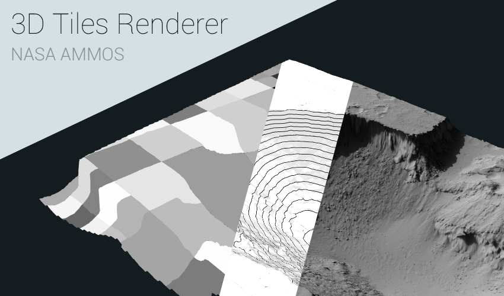

# 3d-tiles-renderer

[](https://www.npmjs.com/package/3d-tiles-renderer)
[](https://travis-ci.com/NASA-AMMOS/3DTilesRendererJS)
[](https://lgtm.com/projects/g/NASA-AMMOS/3DTilesRendererJS/)



Three.js renderer implementation for the [3D Tiles format](https://github.com/AnalyticalGraphicsInc/3d-tiles/blob/master/specification/). The renderer supports a limited subset of the spec. See [Issue #15](https://github.com/NASA-AMMOS/3DTilesRendererJS/issues/15) for information on which features are not yet implemented.

**Examples**

[Kitchen sink example with all options here](https://nasa-ammos.github.io/3DTilesRendererJS/example/bundle/index.html)!

[Custom material example here](https://nasa-ammos.github.io/3DTilesRendererJS/example/bundle/customMaterial.html)!

[Rendering shadows from offscreen tiles example here](https://nasa-ammos.github.io/3DTilesRendererJS/example/bundle/offscreenShadows.html)!

# Use

## Installation

```
npm install 3d-tiles-renderer --save
```

## Basic TilesRenderer

Setting up a basic application a 3D Tileset.

```js
import { TilesRenderer } from '3d-tiles-renderer';

// ... initialize three scene ...

const tilesRenderer = new TilesRenderer( './path/to/tileset.json' );
tilesRenderer.setCamera( camera );
tilesRenderer.setResolutionFromRenderer( camera, renderer );
scene.add( tilesRenderer.group );

renderLoop();

function renderLoop() {

	requestAnimationFrame( renderLoop );

	// The camera matrix is expected to be up to date
	// before calling tilesRenderer.update
	camera.updateMatrixWorld();
	tilesRenderer.update();
	renderer.render( camera, scene );

}
```

## Custom Material

Setting up a 3D Tileset using a custom material.

```js
const tilesRenderer = new TilesRenderer( './path/to/tileset.json' );
tilesRenderer.setCamera( camera );
tilesRenderer.setResolutionFromRenderer( camera, renderer );
tilesRenderer.onLoadModel = function ( scene ) {

	// create a custom material for the tile
	scene.traverse( c => {

		if ( c.material ) {

			c.originalMaterial = c.material;
			c.material = new MeshBasicMaterial();

		}

	} );

};

tilesRenderer.onDisposeModel = function ( scene ) {

	// dispose of any manually created materials
	scene.traverse( c => {

		if ( c.material ) {

			c.material.dispose();

		}

	} );

};
scene.add( tilesRenderer.group );
```

# API

## TilesRenderer

_extends [TilesRendererBase](https://github.com/NASA-AMMOS/3DTilesRendererJS/blob/master/src/base/TilesRendererBase.js), which can be used to implement a 3d tiles renderer in other engines_

### .errorTarget

```js
errorTarget = 6 : Number
```

The target screenspace error in pixels to target when updating the geometry. Tiles will not render if they have below this level of screenspace error.

### .errorThreshold

```js
errorThreshold = Infinity : Number
```

Value used to compute the threshold `errorTarget * errorThreshold` above which tiles will not render. This is used to enable traversal to skip loading and rendering parent tiles far from the cameras current screenspace error requirement.

If `errorThreshold` is set to `Infinity` then all parent tiles will be loaded and rendered. If it's set to `0` then no parent tiles will render and only the tiles that are being rendered will be loaded.

### .maxDepth

```js
maxDepth = Infinity : Number
```

The max depth to which tiles will be loaded and rendered. Setting it to `1` will only render the root tile.

### .loadSiblings

```js
loadSiblings = true : Boolean
```

If true then all sibling tiles will be loaded, as well, to ensure coherence when moving the camera. If false then only currently viewed tiles will be loaded.

### .displayActiveTiles

```js
displayActiveTiles = false : Boolean
```

"Active tiles" are those that are loaded and available but not necessarily visible. If [loadSiblings](#loadSiblings) is true then the tiles loaded up to the extents of the tileset will be considered active even outside the camera view. These tiles are useful for raycasting off camera or for casting shadows.

Active tiles not currently visible in a camera frustum are removed from the scene as an optimization. Setting `displayActiveTiles` to true will keep them in the scene to be rendered from an outside camera view not accounted for by the tiles renderer.

### .autoDisableRendererCulling

```js
autoDisableRendererCulling = true : Boolean
```

If true then all tile meshes automatically have their [frustumCulled](https://threejs.org/docs/index.html#api/en/core/Object3D.frustumCulled) field set to false. This is useful particularly when using one camera because the tiles renderer automatically performs it's own frustum culling on visible tiles. If [displayActiveTiles](#displayActiveTiles) is true or multiple cameras are being used then you may consider setting this to false.

### .lruCache

```js
lruCache = new LRUCache() : LRUCache
```

_NOTE: This cannot be set once [update](#update) is called for the first time._

### .downloadQueue

```js
downloadQueue = new PriorityQueue : PriorityQueue
```

_NOTE: This cannot be set once [update](#update) is called for the first time._

### .parseQueue

```js
parseQueue = new PriorityQueue : PriorityQueue
```

_NOTE: This cannot be modified once [update](#update) is called for the first time._


### .group

```js
group : Group
```

The container group for the 3d tiles. Add this to the three.js scene in order to render it.

When raycasting a higher performance traversal approach is used if `raycaster.firstHitOnly = true`. If true then only the first hit of the terrain is reported in the tileset.

### .constructor

```js
constructor( url : String )
```

Takes the url of the `tileset.json` for the tileset to be rendered.

### .update

```js
update() : void
```

Updates the tiles to render and kicks off loads for the appropriate tiles in the 3d tile set.

Both `group.matrixWorld` and all cameras world matrices are expected to be to date before this is called.

### .getBounds

```js
getBounds( box : Box3 ) : boolean
```

Sets `box` to the root bounding box of the tileset in the [group](#group) frame. Returns `false` if the tile root was not loaded.

### .hasCamera

```js
hasCamera( camera : Camera ) : boolean
```

Returns `true` if the camera has already been set on the renderer.

### .setCamera

```js
setCamera( camera : Camera ) : boolean
```

Adds the camera to the camera to be accounted for when traversing the tileset. Returns `false` if the camera is already being tracked. Returns `true` otherwise.

### .deleteCamera

```js
deleteCamera( camera : Camera ) : boolean
```

Removes the given camera from being accounted for when traversing the tileset. Returns `false` if the camera was not tracked.

### .setResolution

```js
setResolution( camera : Camera, resolution : Vector2 ) : boolean
setResolution( camera : Camera, x : number, y : number ) : boolean
```

Sets the resolution being rendered to for the given camera. Returns `false` if the camera is not being tracked.

### .setResolutionFromRenderer

```js
setResolutionFromRenderer( camera : Camera, renderer : WebGLRenderer ) : boolean
```

Sets the resolution being rendered to for the given camera via renderer which accounts for canvas size and current pixel ratio. Returns `false` if the camera is not being tracked.

### .forEachLoadedModel

```js
forEachLoadedModel( callback : ( scene : Object3D, tile : object ) => void ) : void
```

Fires the callback for every loaded scene in the hierarchy with the associatd tile as the second argument. This can be used to update the materials of all loaded meshes in the tile set.

### .onLoadModel

```js
onLoadModel = null : ( scene : Object3D, tile : object ) => void
```

Callback that is called every time a model is loaded. This can be used in conjunction with [.forEachLoadedModel](#forEachLoadedModel) to set the material of all load and still yet to load meshes in the tile set.

### .onDisposeModel

```js
onDisposeModel = null : ( scene : Object3D, tile : object ) => void
```

Callback that is called every time a model is disposed of. This should be used in conjunction with [.onLoadModel](#onLoadModel) to dispose of any custom materials created for a tile. Note that the textures, materials, and geometries that a tile loaded in with are all automatically disposed of even if they have been removed from the tile meshes.

## DebugTilesRenderer

_extends [TilesRenderer](#TilesRenderer)_

Special variant of TilesRenderer that includes helpers for debugging and visualizing the various tiles in the tileset. Material overrides will not work as expected with this renderer.

### .colorMode

```js
colorMode = NONE : ColorMode
```

Which color mode to use when rendering the tileset. The following exported enumerations can be used:

```js
// No special color mode. Uses the default materials.
NONE

// Render the screenspace error from black to white with errorTarget
// being the maximum value.
SCREEN_ERROR

// Render the geometric error from black to white with maxDebugError
// being the maximum value.
GEOMETRIC_ERROR

// Render the distance from the camera to the tile as black to white
// with maxDebugDistance being the maximum value.
DISTANCE

// Render the depth of the tile relative to the root as black to white
// with maxDebugDepth being the maximum value.
DEPTH

// Render the depth of the tile relative to the nearest rendered parent
// as black to white with maxDebugDepth being the maximum value.
RELATIVE_DEPTH

// Render leaf nodes as white and parent nodes as black.
IS_LEAF

// Render the tiles with a random color to show tile edges clearly.
RANDOM_COLOR
```

### .displayBoxBounds

```js
displayBoxBounds = false : Boolean
```

Display wireframe bounding boxes from the tiles `boundingVolume.box` for every visible tile.

### .displaySphereBounds

```js
displaySphereBounds = false : Boolean
```

Display wireframe bounding boxes from the tiles `boundingVolume.sphere` (or derived from the bounding box) for every visible tile.

### .maxDebugDepth

```js
maxDebugDepth = - 1 : Number
```

The depth value that represents white when rendering with `DEPTH` or `RELATIVE_DEPTH` [colorMode](#colorMode). If `maxDebugDepth` is `-1` then the maximum depth of the tileset is used.

### .maxDebugError

```js
maxDebugError = - 1 : Number
```

The error value that represents white when rendering with `GEOMETRIC_ERROR` [colorMode](#colorMode). If `maxDebugError` is `-1` then the maximum geometric error in the tileset is used.

### .maxDebugDistance

```js
maxDebugDistance = - 1 : Number
```

The distance value that represents white when rendering with `DISTANCE` [colorMode](#colorMode). If `maxDebugDistance` is `-1` then the radius of the tileset is used.

## PriorityQueue

Piority-sorted queue to prioritize file downloads and parsing.

### .maxJobs

```js
maxJobs = 6 : number
```

The maximum number of jobs to be processing at once.

### .unloadPriorityCallback

```js
unloadPriorityCallback = null : ( item ) => Number
```

Function to derive the unload priority of the given item. Higher priority values get unloaded first.

## LRUCache

Utility class for the TilesRenderer to keep track of currently used items so rendered items will not be unloaded.

### .maxSize

```js
maxSize = 800 : number
```

The maximum cached size. If that current amount of cached items is equal to this value then no more items can be cached.

### .minSize

```js
minSize = 600 : number
```

The minimum cache size. Above this cached data will be unloaded if it's unused.

### .unloadPercent

```js
unloadPercent = 0.05 : number
```

The maximum percentage of [minSize](#minSize) to unload during a given frame.

### .priorityCallback

```js
priorityCallback = null : ( item ) => Number
```

Function to derive the job priority of the given item. Higher priority values get processed first.

# LICENSE

The software is available under the [Apache V2.0 license](../LICENSE.txt).

Copyright © 2020 California Institute of Technology. ALL RIGHTS
RESERVED. United States Government Sponsorship Acknowledged.
Neither the name of Caltech nor its operating division, the
Jet Propulsion Laboratory, nor the names of its contributors may be
used to endorse or promote products derived from this software
without specific prior written permission.
