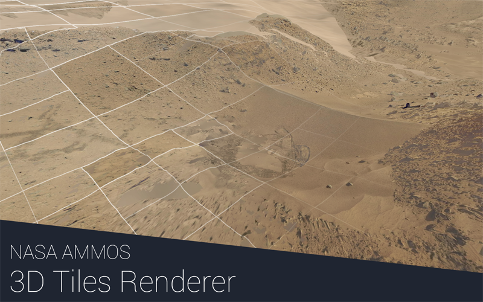

# 3d-tiles-renderer

[](https://www.npmjs.com/package/3d-tiles-renderer)
[](https://github.com/NASA-AMMOS/3DTilesRendererJS/actions)



JavaScript renderer implementation for the [3D Tiles format](https://github.com/AnalyticalGraphicsInc/3d-tiles/blob/master/specification/) with support for both **Three.js** and **Babylon.js**. The renderer supports most of the 3D Tiles spec features with a few exceptions. For a list of available data sets and generation tools see the [3d Tiles resources](https://github.com/CesiumGS/3d-tiles/blob/main/RESOURCES.md) list.

If a tileset or geometry does not load or render properly please make an issue! Example data is needed for adding and testing features. See the [Feature Complete Milestone](https://github.com/NASA-AMMOS/3DTilesRendererJS/milestone/1) for information on which features are not yet implemented.

# Getting Started

## Installation

```
npm install 3d-tiles-renderer --save
```

## API

| Package | Reference |
| --- | --- |
| `3d-tiles-renderer/core` | [API Reference](./src/core/renderer/API.md) |
| `3d-tiles-renderer/three` | [Usage Guide](./USAGE.md) · [API Reference](./src/three/renderer/API.md) |
| `3d-tiles-renderer/babylonjs` | [Usage Guide](./src/babylonjs/renderer/README.md) · [API Reference](./src/babylonjs/renderer/API.md) |
| `3d-tiles-renderer/r3f` | [Usage Guide](./src/r3f/README.md) · [API Reference](./src/r3f/API.md) |

## Plugins

| Package | Reference |
| --- | --- |
| `3d-tiles-renderer/three/plugins` | [Plugin Guide](./src/three/plugins/README.md) · [API Reference](./src/three/plugins/API.md) |
| `3d-tiles-renderer/core/plugins` | [API Reference](./src/core/plugins/API.md) |

# Examples

The following examples use **Three.js**. Babylon.js demos are also available for [Mars](https://nasa-ammos.github.io/3DTilesRendererJS/babylonjs/mars.html) and [Google Photorealistic Tiles](https://nasa-ammos.github.io/3DTilesRendererJS/babylonjs/googleMapsAerial.html).

See the [Three.js usage guide](./USAGE.md) or [Babylon.js usage guide](./src/babylonjs/renderer/README.md) for setup details with each engine.

| Example | Description |
| --- | --- |
| **Core** | |
| [Dingo Gap Mars](https://nasa-ammos.github.io/3DTilesRendererJS/three/mars.html) | Multiple tilesets |
| [Kitchen Sink](https://nasa-ammos.github.io/3DTilesRendererJS/three/index.html) | All options and features |
| [VR](https://nasa-ammos.github.io/3DTilesRendererJS/three/vr.html) | Rendering in VR |
| **External Tiles Providers** ¹ | |
| [Cesium Ion 3D Tiles](https://nasa-ammos.github.io/3DTilesRendererJS/three/ionExample.html) | Standard Cesium Ion tileset |
| [Cesium Ion Lunar](https://nasa-ammos.github.io/3DTilesRendererJS/three/ionLunar.html) | Lunar surface tiles |
| [Cesium Ion Mars](https://nasa-ammos.github.io/3DTilesRendererJS/three/ionLunar.html?mars) | Mars surface tiles |
| [Google Photorealistic](https://nasa-ammos.github.io/3DTilesRendererJS/three/googleMapsAerial.html) | Google Photorealistic Tiles |
| [Google Globe](https://nasa-ammos.github.io/3DTilesRendererJS/three/googleMapsExample.html) | Google Globe Tiles |
| **Customization** | |
| [Custom Material](https://nasa-ammos.github.io/3DTilesRendererJS/three/customMaterial.html) | Using a custom material |
| [Offscreen Shadows](https://nasa-ammos.github.io/3DTilesRendererJS/three/offscreenShadows.html) | Shadows from offscreen tiles |
| [Texture Overlays](https://nasa-ammos.github.io/3DTilesRendererJS/three/landformSiteOverlay.html) | Alternate texture overlays |
| **Plugins** | |
| [Metadata](https://nasa-ammos.github.io/3DTilesRendererJS/three/metadata.html) | Tile metadata |
| [Fade Transition](https://nasa-ammos.github.io/3DTilesRendererJS/three/fadingTiles.html) | Tile LoD fade transition |
| [Deep Zoom](https://nasa-ammos.github.io/3DTilesRendererJS/three/deepZoom.html) | Deep Zoom Image format |
| [TMS / XYZ](https://nasa-ammos.github.io/3DTilesRendererJS/three/mapTiles.html) | TMS, XYZ map tiles |
| [WMTS](https://nasa-ammos.github.io/3DTilesRendererJS/three/wmtsTiles.html) | WMTS map tiles |
| [WMS](https://nasa-ammos.github.io/3DTilesRendererJS/three/wmsTiles.html) | WMS map tiles |
| [Quantized Mesh](https://nasa-ammos.github.io/3DTilesRendererJS/three/quantMeshOverlays.html) | Quantized mesh with overlays |
| [Load Region](https://nasa-ammos.github.io/3DTilesRendererJS/three/loadRegion.html) | Loading tiles in region volumes |
| [GeoJSON](https://nasa-ammos.github.io/3DTilesRendererJS/three/geojson.html) | GeoJSON overlays |
| [Vector Tiles](https://nasa-ammos.github.io/3DTilesRendererJS/three/pmtiles.html) | Mapbox Vector Tiles and Protomap Tiles overlays |

¹ Requires a [Google Tiles API Key](https://developers.google.com/maps/documentation/tile/3d-tiles) or [Cesium Ion API Key](https://cesium.com/platform/cesium-ion/)

# Community Resources

Here is a reference to existing 3DTilesRendererJS integrations:

- [three-geospatial](https://github.com/takram-design-engineering/three-geospatial): Clouds and atmosphere rendering via a three.js geospatial rendering modules, alongside 3DTilesRendererJS.
- [3D Tiles in MapLibre Guide](https://maplibre.org/maplibre-gl-js/docs/examples/add-3d-tiles-using-threejs/): Official example showing how to render 3D tiles using a synced Three.js layer.
- [Giro3D](https://gitlab.com/giro3d/giro3d): Framework for visualizing and interacting with heterogenous geospatial data in the browser, 2D, 2.5D and 3D data.
- [iTowns](https://github.com/iTowns/itowns/): Framework designed for the efficient visualization, navigation, and interaction with 2D and 3D geospatial data on the web.
- [threepipe Plugin](https://threepipe.org/package/plugin-3d-tiles-renderer.html): Plugin for the threepipe rendering framework integrating 3DTilesRendererJS.
- [3DBAG Viewer](https://github.com/3DBAG/3dbag-viewer): Web viewer for the 3DBAG dataset, a nationwide 3D model of all buildings in the Netherlands built with roofer.
- [Babylon.js Guide](https://doc.babylonjs.com/features/featuresDeepDive/geospatial/loading3dTiles/): Official documention on integrating 3DTilesRendererJS into your Babylon.js project.
- [Community Plugins](https://github.com/NASA-AMMOS/3DTilesRendererJS/tree/master/src/three/plugins#community-plugins): Additional community-maintained threejs plugins for 3DTilesRendererJS.

# LICENSE

The software is available under the [Apache V2.0 license](LICENSE).

Copyright © 2020 California Institute of Technology. ALL RIGHTS
RESERVED. United States Government Sponsorship Acknowledged.
Neither the name of Caltech nor its operating division, the
Jet Propulsion Laboratory, nor the names of its contributors may be
used to endorse or promote products derived from this software
without specific prior written permission.
